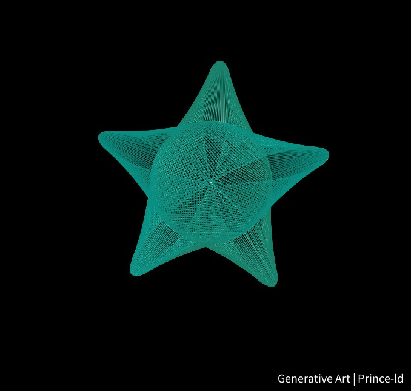

# ⭐ Star Graphic in p5.js

[](https://p5js.org/)   

Welcome to the **Star Graphic** project! 🌟✨ This project utilizes **p5.js** to create a visually stunning representation of a star. The graphic showcases the versatility and creativity that p5.js offers for developing engaging visuals.



## 🎥 Demo Video

Watch the star graphic come to life! 🎬🌌

<video controls src="media/star.mp4" title="Star Graphic Video Demonstration"></video>

## 🌟 Features

✨ **Interactive Design**: Explore the beauty of a star with interactive elements.  
🎨 **Dynamic Visualization**: Bright colors and smooth animations create a captivating experience.  
💻 **Responsive**: Adaptable to various screen sizes, ensuring a delightful experience on all devices.  

## 🚀 Tech Stack

- 🛠️ **p5.js**: To create the visual and interactive elements.

## 🗂️ Project Structure

```plaintext
|-- /media
|   |-- start-wp.jpg                            # Screenshot of the star 
|   |-- star.mp4                                # Video demo
|-- sketch.java 
|-- README.md                                   # Readme file
```

## 🏃‍♂️ How to Run

1. **Clone the repo** 🧑‍💻:

```bash
git clone https://github.com/prince-gh/star.git
```

2. **Open** the `index.html` file in your web browser.  
3. **Enjoy** the star graphic! 🌟✨

## 📈 Roadmap

- 🌟 Add more shapes and graphics for variety.
- ✨ Enhance interactivity with user controls.
- 🌌 Explore different color schemes and animations.

## 🤝 Contributions

Got an idea? 💡 Spot a bug? 🐞 PRs are welcome! Feel free to submit pull requests or issues to help improve the project. Let's collaborate to make this even better! 💪

## 🧑‍💻 Author

- GitHub: [prince-gh](https://github.com/prince-gh)

---

Happy Exploring! ⭐🌌
